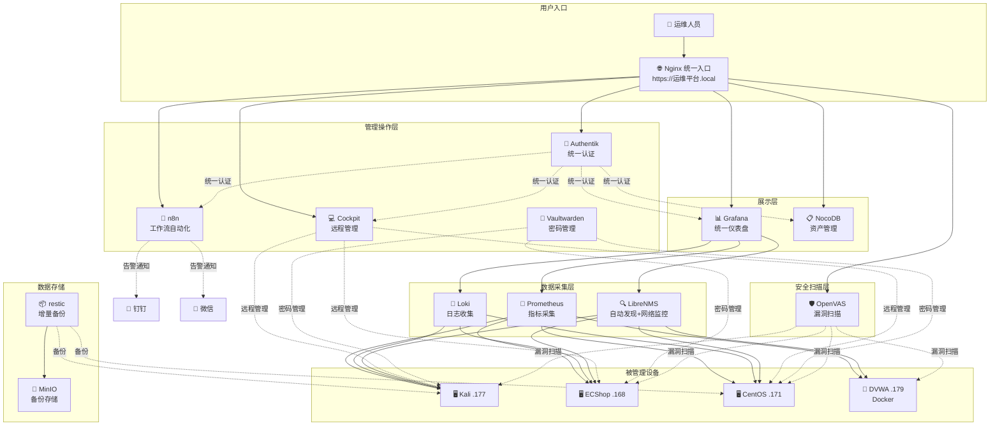
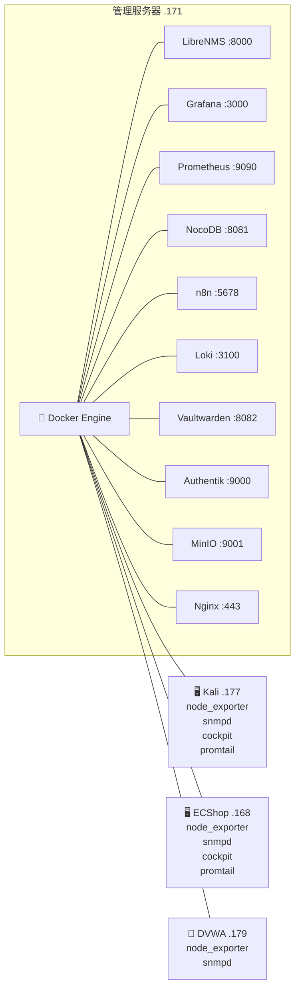
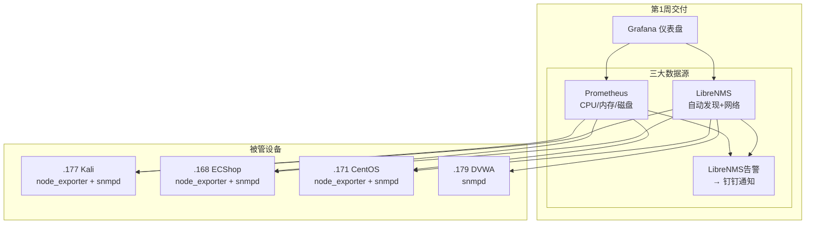
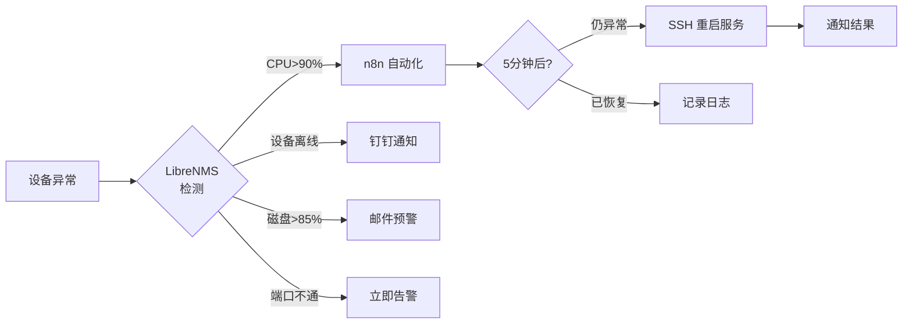

# IT 运维管理平台 — 总体架构

## 一、四层架构总览

---

## 二、部署拓扑

---

## 三、第一阶段：核心监控拓扑

---

## 四、告警流向图

---

> 📐 架构图在 Obsidian 中打开即可渲染为图形。已用 Excalidraw MCP 绘制专业版。

## 🎨 Excalidraw 版架构图

![[IT运维平台架构图.excalidraw]]

> 双击上方嵌入图可在 Excalidraw 中编辑。颜色分层：🟢用户入口→🔵展示→🟠管理→🟣采集→🔴存储→⚫设备
